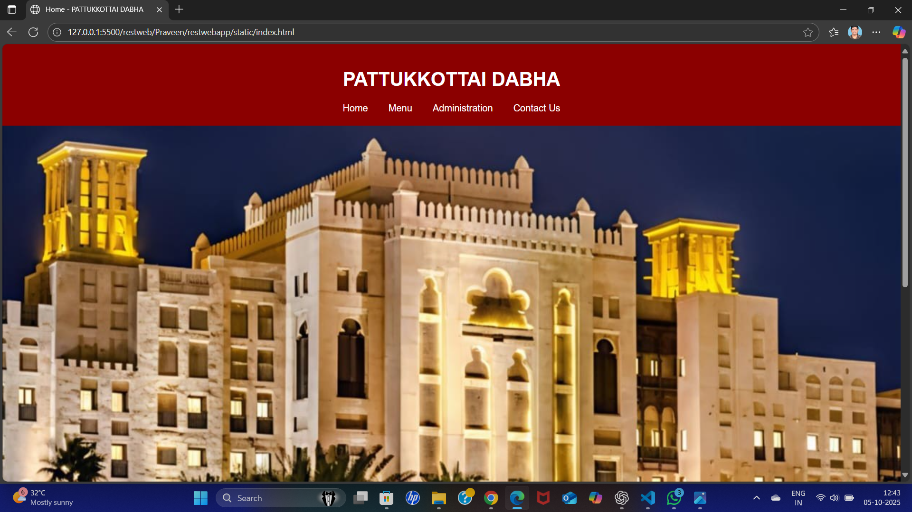
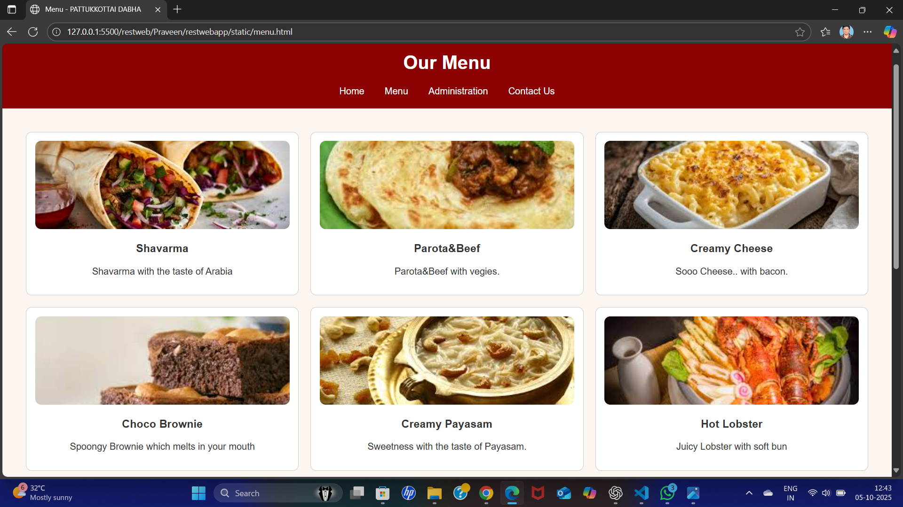
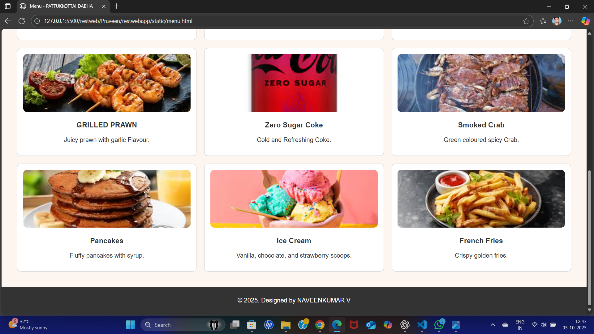
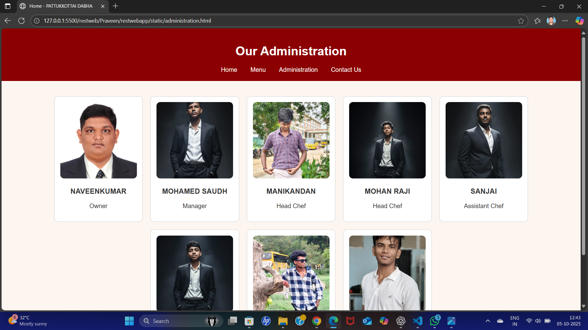
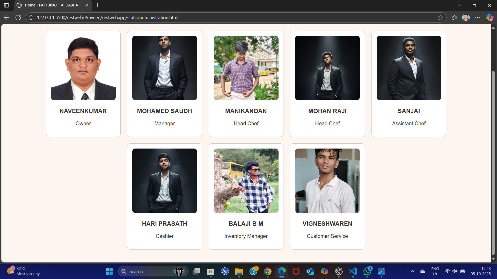
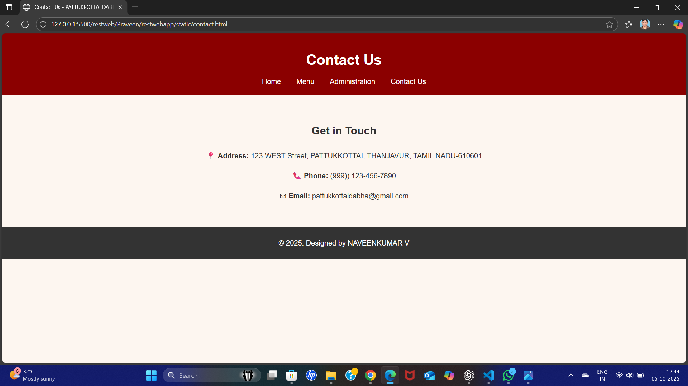

# Ex.07 Restaurant Website
## Date: 05-10-2025
## Register Number: 25016071
## Name: NAVEENKUMAR V

## AIM:
To develop a static Restaurant website to display the food items and services provided by them.

## DESIGN STEPS:

### Step 1:
Requirement collection.

### Step 2:
Creating the layout using HTML and CSS.

### Step 3:
Updating the sample content.

### Step 4:
Choose the appropriate style and color scheme.

### Step 5:
Validate the layout in various browsers.

### Step 6:
Validate the HTML code.

### Step 7:
Publish the website in the given URL.

## PROGRAM:
administration.html
```
<!DOCTYPE html>
<html lang="en">
<head>
  <meta charset="UTF-8">
  <title>Home - PATTUKKOTTAI DABHA</title>
  <link rel="stylesheet" href="style.css">
</head>
<style class="css">
    /* style.css */
body {
  margin: 0;
  font-family: Arial, sans-serif;
  background-color: #fdf6f0;
  color: #333;
}

header {
  background-color: #8B0000;
  color: white;
  padding: 20px;
  text-align: center;
}

nav a {
  color: white;
  margin: 0 15px;
  text-decoration: none;
}

.banner img {
  width: 100%;
  height: auto;
}

section.content {
  padding: 40px;
  text-align: center;
}

.menu-grid {
  display: grid;
  grid-template-columns: repeat(3, 1fr);
  gap: 20px;
  padding: 40px;
}

.menu-item {
  background-color: #fff;
  border: 1px solid #ccc;
  padding: 15px;
  border-radius: 10px;
  text-align: center;
}

.menu-item img {
  width: 100%;
  height: 150px;
  object-fit: cover;
  border-radius: 10px;
}

.admin-grid {
  display: flex;
  flex-wrap: wrap;
  gap: 20px;
  padding: 40px;
  justify-content: center;
}

.admin-card {
  width: 200px;
  background-color: #fff;
  padding: 15px;
  border-radius: 10px;
  text-align: center;
  border: 1px solid #ccc;
}

.admin-card img {
  width: 100%;
  height: 200px;
  object-fit: cover;
  border-radius: 10px;
}

.contact-info {
  padding: 40px;
  text-align: center;
  line-height: 1.8;
}

footer {
  background-color: #333;
  color: white;
  text-align: center;
  padding: 10px;
}
  </style>
<body>
  <header>
    <h1>Our Administration</h1>
    <nav>
      <a href="index.html">Home</a>
      <a href="menu.html">Menu</a>
      <a href="administration.html">Administration</a>
      <a href="contact.html">Contact Us</a>
    </nav>
  </header>
  <section class="admin-grid">
    <div class="admin-card">
      
      <h3>NAVEENKUMAR</h3>
      <p>Owner</p>
    </div>

    <div class="admin-card">
      
      <h3>MOHAMED SAUDH</h3>
      <p>Manager</p>
    </div>

    <div class="admin-card">
      
      <h3>MANIKANDAN</h3>
      <p>Head Chef</p>
    </div>

    <div class="admin-card">
      
      <h3>MOHAN RAJI</h3>
      <p>Head Chef</p>
    </div>

    <div class="admin-card">
      
      <h3>SANJAI</h3>
      <p>Assistant Chef</p>
    </div>

    <div class="admin-card">
      
      <h3>HARI PRASATH</h3>
      <p>Cashier</p>
    </div>

    <div class="admin-card">
      
      <h3>BALAJI B M</h3>
      <p>Inventory Manager</p>
    </div>

    <div class="admin-card">
      
      <h3>VIGNESHWAREN</h3>
      <p>Customer Service</p>
    </div>
  </section>
</body>
</html>
```
contact.html
```
<!DOCTYPE html>
<html lang="en">
<head>
  <meta charset="UTF-8">
  <title>Contact Us - PATTUKKOTTAI DABHA</title>
  <link rel="stylesheet" href="style.css">
  <style class="css">
    /* style.css */
body {
  margin: 0;
  font-family: Arial, sans-serif;
  background-color: #fdf6f0;
  color: #333;
}

header {
  background-color: #8B0000;
  color: white;
  padding: 20px;
  text-align: center;
}

nav a {
  color: white;
  margin: 0 15px;
  text-decoration: none;
}

.banner img {
  width: 100%;
  height: auto;
}

section.content {
  padding: 40px;
  text-align: center;
}

.menu-grid {
  display: grid;
  grid-template-columns: repeat(3, 1fr);
  gap: 20px;
  padding: 40px;
}

.menu-item {
  background-color: #fff;
  border: 1px solid #ccc;
  padding: 15px;
  border-radius: 10px;
  text-align: center;
}

.menu-item img {
  width: 100%;
  height: 150px;
  object-fit: cover;
  border-radius: 10px;
}

.admin-grid {
  display: flex;
  flex-wrap: wrap;
  gap: 20px;
  padding: 40px;
  justify-content: center;
}

.admin-card {
  width: 200px;
  background-color: #fff;
  padding: 15px;
  border-radius: 10px;
  text-align: center;
  border: 1px solid #ccc;
}

.admin-card img {
  width: 100%;
  height: 180px;
  object-fit: cover;
  border-radius: 10px;
}

.contact-info {
  padding: 40px;
  text-align: center;
  line-height: 1.8;
}

footer {
  background-color: #333;
  color: white;
  text-align: center;
  padding: 10px;
}
  </style>
</head>
<body>

  <header>
    <h1>Contact Us</h1>
    <nav>
      <a href="index.html">Home</a>
      <a href="menu.html">Menu</a>
      <a href="administration.html">Administration</a>
      <a href="contact.html">Contact Us</a>
    </nav>
  </header>

  <section class="contact-info">
    <h2>Get in Touch</h2>
    <p>📍 <strong>Address:</strong> 123 WEST Street, PATTUKKOTTAI, THANJAVUR, TAMIL NADU-610601</p>
    <p>📞 <strong>Phone:</strong> (999)) 123-456-7890 </p>
    <p>✉ <strong>Email:</strong> pattukkottaidabha@gmail.com</p>
  </section>
  


 <!-- Optional: Contact Form (if needed) -->
  <!--
  <section class="contact-form">
    <form>
      <label for="name">Name:</label><br>
      <input type="text" id="name" name="name"><br><br>

      <label for="email">Email:</label><br>
      <input type="email" id="email" name="email"><br><br>

      <label for="message">Message:</label><br>
      <textarea id="message" name="message" rows="5"></textarea><br><br>

      <button type="submit">Send Message</button>
    </form>
  </section>
  -->

  <footer>
    <p>&copy; 2025. Designed by NAVEENKUMAR V</p>
  </footer>

</body>
</html>
```
menu.html
```
<!DOCTYPE html>
<html lang="en">
<head>
  <meta charset="UTF-8">
  <title>Menu - PATTUKKOTTAI DABHA</title>
  <link rel="stylesheet" href="style.css">
  <style class="css">
    /* style.css */
body {
  margin: 0;
  font-family: Arial, sans-serif;
  background-color: #fdf6f0;
  color: #333;
}

header {
  background-color: #8B0000;
  color: white;
  padding: 20px;
  text-align: center;
}

nav a {
  color: white;
  margin: 0 15px;
  text-decoration: none;
}

.banner img {
  width: 100%;
  height: auto;
}

section.content {
  padding: 40px;
  text-align: center;
}

.menu-grid {
  display: grid;
  grid-template-columns: repeat(3, 1fr);
  gap: 20px;
  padding: 40px;
}

.menu-item {
  background-color: #fff;
  border: 1px solid #ccc;
  padding: 15px;
  border-radius: 10px;
  text-align: center;
}

.menu-item img {
  width: 100%;
  height: 150px;
  object-fit: cover;
  border-radius: 10px;
}

.admin-grid {
  display: flex;
  flex-wrap: wrap;
  gap: 20px;
  padding: 40px;
  justify-content: center;
}

.admin-card {
  width: 200px;
  background-color: #fff;
  padding: 15px;
  border-radius: 10px;
  text-align: center;
  border: 1px solid #ccc;
}

.admin-card img {
  width: 100%;
  height: 180px;
  object-fit: cover;
  border-radius: 10px;
}

.contact-info {
  padding: 40px;
  text-align: center;
  line-height: 1.8;
}

footer {
  background-color: #333;
  color: white;
  text-align: center;
  padding: 10px;
}
  </style>
</head>
<body>
  <header>
    <h1>Our Menu</h1>
    <nav>
      <a href="index.html">Home</a>
      <a href="menu.html">Menu</a>
      <a href="administration.html">Administration</a>
      <a href="contact.html">Contact Us</a>
    </nav>
  </header>

  <section class="menu-grid">
    <!-- Repeat for 09 items -->
    <div class="menu-item">
      
      <h3>Shavarma</h3>
      <p>Shavarma with the taste of Arabia</p>
    </div>
    <div class="menu-item">
      
      <h3>Parota&Beef</h3>
      <p>Parota&Beef with vegies.</p>
    </div>
    <div class="menu-item">
      
      <h3>Creamy Cheese</h3>
      <p>Sooo Cheese.. with bacon.</p>
    </div>
    <div class="menu-item">
      
      <h3>Choco Brownie</h3>
      <p>Spoongy Brownie which melts in your mouth</p>
    </div>
    <div class="menu-item">
      
      <h3>Creamy Payasam</h3>
      <p>Sweetness with the taste of Payasam.</p>
    </div>
    <div class="menu-item">
      
      <h3>Hot Lobster</h3>
      <p>Juicy Lobster with soft bun</p>
    </div>
    <div class="menu-item">
      
      <h3>GRILLED PRAWN</h3>
      <p>Juicy prawn with garlic Flavour.</p>
    </div>
    <div class="menu-item">
      
      <h3>Zero Sugar Coke</h3>
      <p>Cold and Refreshing Coke.</p>
    </div>
    <div class="menu-item">
      
      <h3>Smoked Crab</h3>
      <p>Green coloured spicy Crab.</p>
    </div>
    <div class="menu-item">
      
      <h3>Pancakes</h3>
      <p>Fluffy pancakes with syrup.</p>
    </div>
    <div class="menu-item">
      
      <h3>Ice Cream</h3>
      <p>Vanilla, chocolate, and strawberry scoops.</p>
    </div>
    <div class="menu-item">
      
      <h3>French Fries</h3>
      <p>Crispy golden fries.</p>
    </div>
  </section>

  <footer>
    <p>&copy; 2025. Designed by NAVEENKUMAR V</p>
  </footer>
</body>
</html>
```
index.html
```
<!DOCTYPE html>
<html lang="en">
<head>
  <meta charset="UTF-8">
  <title>Home - PATTUKKOTTAI DABHA</title>
  <link rel="stylesheet" href="style.css">
  <style class="css">
    /* style.css */
body {
  margin: 0;
  font-family: Arial, sans-serif;
  background-color: #fdf6f0;
  color: #333;
}

header {
  background-color: #8B0000;
  color: white;
  padding: 20px;
  text-align: center;
}

nav a {
  color: white;
  margin: 0 15px;
  text-decoration: none;
}

.banner img {
  width: 100%;
  height: auto;
}

section.content {
  padding: 40px;
  text-align: center;
}

.menu-grid {
  display: grid;
  grid-template-columns: repeat(3, 1fr);
  gap: 20px;
  padding: 40px;
}

.menu-item {
  background-color: #fff;
  border: 1px solid #ccc;
  padding: 15px;
  border-radius: 10px;
  text-align: center;
}

.menu-item img {
  width: 100%;
  height: 150px;
  object-fit: cover;
  border-radius: 10px;
}

.admin-grid {
  display: flex;
  flex-wrap: wrap;
  gap: 20px;
  padding: 40px;
  justify-content: center;
}

.admin-card {
  width: 200px;
  background-color: #fff;
  padding: 15px;
  border-radius: 10px;
  text-align: center;
  border: 1px solid #ccc;
}

.admin-card img {
  width: 100%;
  height: 180px;
  object-fit: cover;
  border-radius: 10px;
}

.contact-info {
  padding: 40px;
  text-align: center;
  line-height: 1.8;
}

footer {
  background-color: #333;
  color: white;
  text-align: center;
  padding: 10px;
}
  </style>
</head>
<body>
  <header>
    <h1> PATTUKKOTTAI DABHA</h1>
    <nav>
      <a href="index.html">Home</a>
      <a href="menu.html">Menu</a>
      <a href="administration.html">Administration</a>
      <a href="contact.html">Contact Us</a>
    </nav>
  </header>
  <section class="banner">
    
  </section>


  <section class="content">
    <h2>Welcome!</h2>
    <p>Discover the best food in town, made with passion and fresh ingredients.</p>
  </section>

  

  <footer>
    <p>&copy; 2025. Designed by NAVEENKUMAR V</p>
  </footer>
</body>
</html>
```

## OUTPUT:








## RESULT:
The program for designing software company website using HTML and CSS is completed successfully.